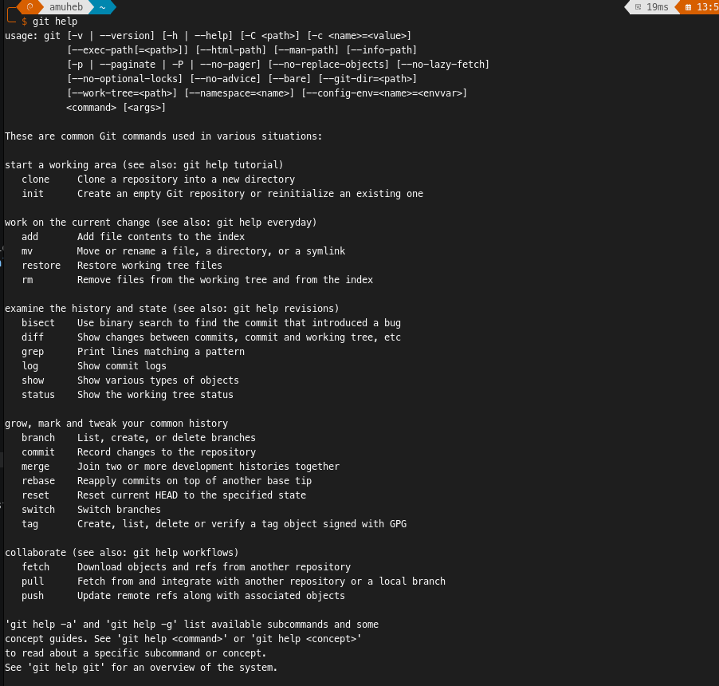

# KN01 - Git Client lokal einrichten und nutzen

## Ziel
Der Git Client wurde auf dem lokalen Computer installiert und korrekt konfiguriert. Anschliessend wurde überprüft, ob die grundlegenden Git-Befehle ohne Fehlermeldung funktionieren.

## Durchführung
1. Git auf dem Computer installiert.
2. Git mit Benutzername und E-Mail konfiguriert.
3. Die wichtigsten Befehle lokal getestet.

## Verwendete Befehle
```bash
git --version
git help
git config --global user.name "ahmadshoaib.muhebali"
git config --global user.email "shoaib.jawadi4@gmail.com"
git config --global --list
```

## Nachweis
Die folgenden Punkte wurden erfolgreich geprüft:

- Git ist installiert und liefert mit `git --version` eine Version zurück.
- Git ist korrekt konfiguriert und zeigt mit `git config --global --list` den Benutzernamen sowie die E-Mail-Adresse an.
- `git help` funktioniert ohne Fehlermeldung.

## Screenshots
### 1. Git-Version
Hier den Screenshot von `git --version` einfügen.


### 2. Globale Git-Konfiguration
Hier den Screenshot von `git config --global --list` einfügen.


### 3. Git-Hilfe
Hier den Screenshot von `git help` einfügen.



## Fazit
Der Git Client ist lokal eingerichtet und einsatzbereit. Die Installation und Konfiguration wurden erfolgreich überprüft.
