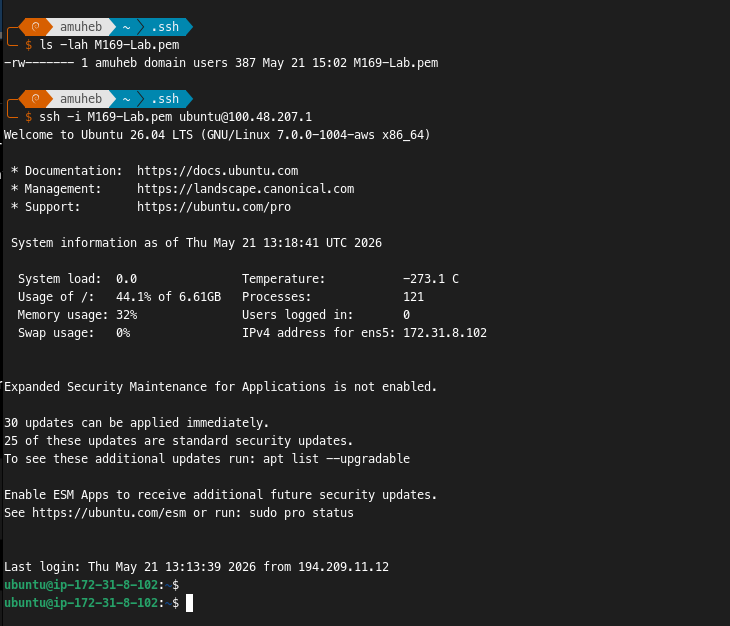
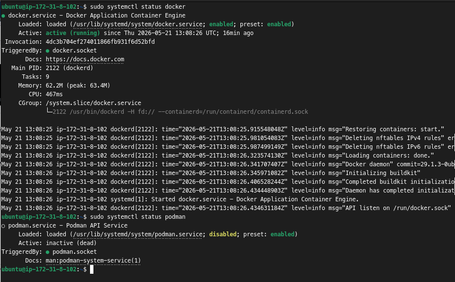
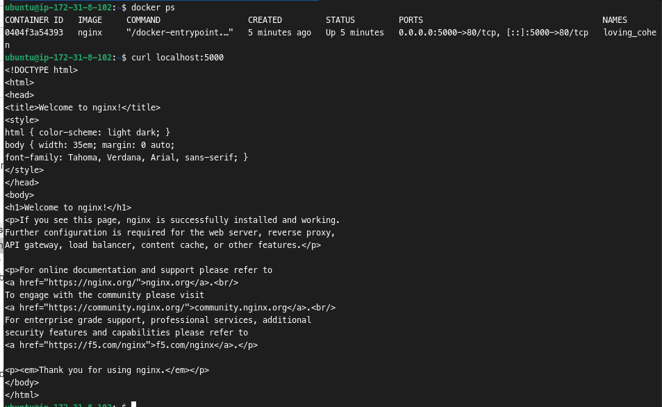

# KN03 

## 1. Teil-Challenge: 

- 1. Sie können per SSH auf Ihre EC2-Instanz zugreifen und wissen, wo der Privat-Key gespeichert ist (für spätere Challenges)



- 2. Die Kommandos docker --version und podman --version liefern eine fehlerfreie Antwort (mit Screenshots und Erklärung im Repo).

	**Antwort:**
	- **Docker** ist bei `systemctl status` oft **active**, weil es mit dem dauerhaft laufenden Daemon **dockerd** arbeitet.
	- **Podman** ist **daemonless** und benötigt keinen permanenten Hintergrunddienst.
	- Deshalb ist Podman im `systemctl status` meist **inactive** oder gar nicht als laufender Dienst sichtbar.
	- Das ist normal: Docker verwaltet Container zentral über einen Dienst, Podman startet Container direkt als Prozesse.

	**Warum Podman besser als Docker:**
	- **Rootless-Betrieb möglich:** Podman kann Container ohne Root-Rechte betreiben, was die Angriffsfläche reduziert und die Sicherheit erhöht.
	- **Kein zentraler Daemon:** Ohne dauerhaften Hintergrunddienst gibt es weniger laufende Komponenten, weniger Ressourcenverbrauch und geringeres Risiko bei Dienstkompromittierung.
	- **Bessere systemd-Integration:** Podman lässt sich einfach mit systemd-Units orchestrieren und eignet sich dadurch gut für Produktionsumgebungen auf Linux-Hosts.
	- **Kompatible CLI:** Die meisten Docker-Kommandos funktionieren mit Podman (z.B. podman run, podman build), was den Umstieg erleichtert.
	- **Feinere Berechtigungen:** Durch Namespaces und rootless-Modus können Container sicherer und isolierter betrieben werden.
	- **Einfacheres Audit/Debugging:** Da Container als normale Prozesse laufen, sind klassische Linux-Tools (ps, top, strace) direkt nutzbar.



- 3. Recherchieren Sie den Unterschied zwischen Docker und Podman. Sie können erklären, weshalb der der Podman-Dienst inactive ist im laufenden Betrieb und welche Vorteile sich daraus schliessen lassen:

	**Antwort:**
	- **Docker** nutzt typischerweise einen zentralen Hintergrunddienst (**dockerd**), der dauerhaft läuft und Container verwaltet.
	- **Podman** ist **daemonless**: Es braucht keinen dauerhaft laufenden zentralen Dienst. Container werden direkt als normale Prozesse gestartet und können über systemd verwaltet werden.
	- Darum ist der Podman-Dienst im Betrieb oft **inactive**: Das ist normal, weil kein permanenter Daemon nötig ist.
	- **Vorteile daraus:**
		- kleinere Angriffsfläche (kein ständig laufender Root-Daemon nötig),
		- weniger Ressourcenverbrauch im Leerlauf,
		- rootless Betrieb möglich (mehr Sicherheit),
		- bessere Integration in Linux/systemd.

## 2. Teil-Challenge
### 2a. Teil-Leistungsnachweis - Lab und Doku im Repo
- 1. Sie können die grundlegenden Docker-Befehle docker run, docker ps und docker stop ausführen und erklären, wie diese funktionieren:

	**Antwort:**
	- `docker run <image>`: Erstellt und startet einen neuen Container aus einem Image. Falls das Image lokal fehlt, wird es automatisch aus einer Registry heruntergeladen.
	- `docker ps`: Zeigt alle aktuell laufenden Container mit wichtigen Informationen wie Container-ID, Name, Status und Ports.
	- `docker stop <container>`: Stoppt einen laufenden Container sauber (sendet zuerst ein Stop-Signal und beendet ihn danach).

	**Beispiel:**
	```bash
	# Container starten
	docker run -d --name web nginx

	# Laufende Container anzeigen
	docker ps

	# Container stoppen
	docker stop web
	```
- 2. Sie haben einen Docker-Container erfolgreich gestartet und können den Status des Containers mit docker ps überprüfen (mit Screenshot): 

<figure>
	
	<figcaption>docker ps: Zeigt einen laufenden Nginx-Container, der Host-Port 5000 an Container-Port 80 weiterleitet. curl localhost:5000 testet die Verbindung.</figcaption>
</figure>

- 3.  Dokumentieren Sie den Unterschied zwischen einem Docker-Container und einer VM so, dass Sie dies im Fachgespräch mit eigenen Worten erklären können:

	**Antwort:**
	- **VM (Virtual Machine):** Eine VM ist ein komplettes virtualisiertes Betriebssystem mit eigenem Kernel, Dateisystem und allen Ressourcen. Sie benötigt viel Speicher und Zeit zum Starten (Minuten).
	- **Docker-Container:** Ein Container ist leichtgewichtig und teilt sich den Host-Kernel. Er enthält nur die Anwendung und ihre Abhängigkeiten. Container starten in Sekunden und verbrauchen weniger Ressourcen.
	- **Kurz gesagt:** VMs simulieren komplette Computer, Container sind isolierte Prozesse auf demselben Betriebssystem.

## 2b. Teil-Leistungsnachweis Fachgespräch

- Erklären Sie in eigenen Worten den Unterschied zwischen einem Image und einem Container.

	**Antwort:**
	- Ein **Image** ist die unveränderliche Vorlage oder Bauanleitung für einen Container.
	- Ein **Container** ist die laufende Instanz dieses Images, also die ausgeführte Umgebung mit eigenem Dateisystem und Prozessraum.
	- Kurz gesagt: Das Image ist die Vorlage, der Container ist das gestartete Ergebnis.

- Warum ist eine Registry wie Docker Hub wichtig?

	**Antwort:**
	- Eine Registry ist wichtig, weil Images dort gespeichert, versioniert und verteilt werden.
	- Über Docker Hub kann man Images einfach herunterladen und eigene Images für andere bereitstellen.
	- Dadurch lassen sich Projekte reproduzierbar und teamübergreifend verwenden.

- Container arbeiten **isoliert**. Welche Vorteile ergeben sich daraus?

	**Antwort:**
	- Prozesse und Abhängigkeiten beeinflussen sich weniger gegenseitig.
	- Fehler in einem Container wirken sich nicht direkt auf andere Container aus.
	- Mehrere Anwendungen können auf demselben Host parallel und sauber getrennt laufen.
	- Die Isolation erhöht die Sicherheit und macht Tests sowie Deployments kontrollierbarer.

- **Bonus-Credit**: Der nginx-Webserver läuft im Container und Sie können darauf zugreifen - Live demonstrieren.

	**Antwort:**
	- Der nginx-Container läuft und ist über den freigegebenen Port erreichbar.
	- Der Zugriff kann live mit dem Browser oder mit `curl` auf den Host-Port demonstriert werden.
    
