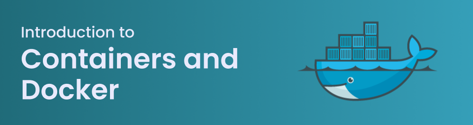

# M169 Repository

[TOC]

## Einleitung
Dieses Repository begleitet das Modul M169. Im Modul werden grundlegende Konzepte rund um Container-Technologien vermittelt und praktisch angewendet. Ziel ist, dass Studierende verstehen, wie Container im Vergleich zu klassischen virtuellen Maschinen (VMs) funktionieren und wie man containerisierte Anwendungen erstellt, betreibt und dokumentiert.

Kerninhalte des Moduls:

- Grundlagen: Was sind Container, wie unterscheiden sie sich von VMs und welche Vorteile bieten sie (z. B. geringerer Overhead, schnellere Startzeiten, einfache Skalierung).
- Images & Container: Erstellen und Starten von Containern aus vorgefertigten oder selbstgebauten Images; Aufbau und Best Practices für Dockerfiles.
- Verwaltung & Persistenz (Volumes): Einsatz von Volumes, damit Datenbanken und persistent gespeicherte Daten beim Neustart oder Austausch von Containern erhalten bleiben.
- Portweiterleitung: Zugänglichmachen von Diensten innerhalb eines Containers durch Weiterleitung von Ports vom Host auf den Container.
- Netzwerk & Konfiguration: Einrichten von Container-Netzwerken und sichere Kommunikation zwischen Services (z. B. Webserver ↔ Datenbank); Umgang mit Umgebungsvariablen und Konfigurationsdateien.
- Dokumentation: Richtiges Dokumentieren der Services und Container-Architekturen (Dockerfiles, Compose-Dateien, Ports, Volumes, Start-/Stop-Anweisungen).

## Custom Projekt: SnappyMail E-Mail Server

Nach Rücksprache mit dem Unterrichtsleiter wurde entschieden, ein **Custom-Projekt** durchzuführen, anstatt die separaten Kompetenznachweise (KN01-KN05) zu bearbeiten. 

Dieses Projekt umfasst die Implementierung eines vollständigen, E-Mail-Server mit Web-Interface, basierend auf Docker Swarm und AWS-Infrastruktur.

### 📚 Projektdokumentation

**Gesamtprojekt-Dokumentation:**
- [**SnappyMail E-Mail Server Dokumentation**](./snappy-mail/DOKUMENTATION_DE.md) - Vollständige Beschreibung der Mail-Server Architektur, Komponenten und Konfiguration

**Infrastructure as Code (IaC):**
- [**AWS Terraform Dokumentation**](./terraform/DOKUMENTATION_AWS_DE.md) - Detaillierte Dokumentation der AWS-Infrastruktur, EC2-Instanzen und Networking

**Container-Orchestration:**
- [**Docker Swarm Installationsanleitung**](./docker-swarm/INSTALLATIONSANLEITUNG_DE.md) - Schritt-für-Schritt Anleitung zur Initialisierung und Konfiguration des Docker Swarm Clusters
- [**Docker Swarm Quick Reference**](./docker-swarm/QUICK_REFERENCE_DE.md) - Schnellreferenz mit Scripts und Befehle für Cluster-Verwaltung

### 🎯 Projektumfang

Dieses Projekt demonstriert folgende M169-Kompetenzen:

- **Container-Grundlagen**: Docker-Images, Container-Lifecycle, Dockerfile-Best-Practices
- **Orchestration**: Docker Swarm Mode, Multi-Node Cluster, Service-Verwaltung
- **Volumes & Persistierung**: Named Volumes, Bind-Mounts, Datensicherung
- **Netzwerk & Kommunikation**: Overlay Networks, Service Discovery, Reverse Proxy (Traefik)
- **Skalierung & Hochverfügbarkeit**: Load-Balancing, Multi-Node Deployment, Redundanz
- **Cloud Infrastructure**: AWS, Terraform (IaC), EC2, VPC, Security Groups
- **Dokumentation**: Umfassende technische Dokumentation

### 📁 Projektverzeichnisse

- [**snappy-mail/**](./snappy-mail/) - E-Mail-Server Konfiguration und Komponenten
- [**terraform/**](./terraform/) - AWS Infrastructure-as-Code mit Terraform
- [**docker-swarm/**](./docker-swarm/) - Docker Swarm Setup und Verwaltung
- [**Bild/**](./Bild/) - Architektur-Diagramme und Visualisierungen

## Reflexion

**Erkenntnisse auf metakognitiver Ebene:**

Durch die Implementierung des SnappyMail E-Mail-Servers habe ich gelernt, dass Container-Technologie weit mehr ist als isolierte Applikationen zu verpacken. Das Projekt zeigt, wie sich Container-Grundlagen (Images, Volumes, Ports) in einem realen, komplexen System mit Anforderungen wie Hochverfügbarkeit, Skalierung und Sicherheit zusammenfügen.

Besonders wertvoll war die praktische Erkenntnis, dass:
- **Docker Swarm** nicht nur für einfache Deployments gedacht ist, sondern für robuste Produktionsumgebungen notwendig wird
- **Infrastructure as Code (Terraform)** die Reproduzierbarkeit und Wartbarkeit massiv verbessert
- **Dokumentation** keine nachträgliche Aufgabe ist, sondern zentral für ein funktionierendes System

Das Projekt hat deutlich gemacht, dass M169 die Grundlagen für industrielle Container-Orchestration vermittelt – Wissen, das direkt in modernen DevOps-Workflows angewendet wird.

**Projekt-relevante Ressourcen:**
  * [Docker Documentation](https://docs.docker.com/) - Offizielle Docker-Dokumentation
  * [Docker Swarm Mode Guide](https://docs.docker.com/engine/swarm/) - Docker Swarm Orchestration
  * [Terraform AWS Provider](https://registry.terraform.io/providers/hashicorp/aws/latest) - Terraform AWS-Dokumentation
  * [AWS EC2 Documentation](https://docs.aws.amazon.com/ec2/) - Amazon Elastic Compute Cloud
  * [Traefik Documentation](https://doc.traefik.io/) - Reverse Proxy und Ingress Controller
  * [Docker Mailserver](https://docker-mailserver.github.io/) - Offizielle DMS Dokumentation
  * [PostfixAdmin](https://github.com/postfixadmin/docker) - Mail Server Admin-Interface
  * [SnappyMail / RainLoop](https://github.com/the-djmaze/snappymail/tree/master) - Webmail-Client

 

---

> [⇧ **Nach oben**](#m169-repository)

___
